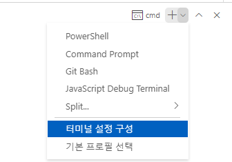
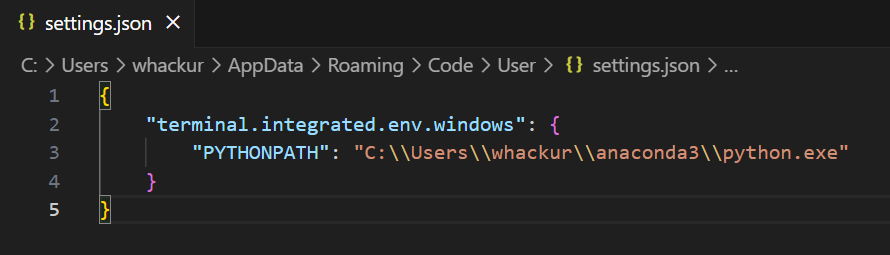
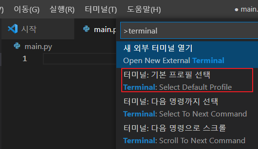

# 내용 업데이트

---
> 파이썬의 버전 업그레이드 또는 사용하는 라이브러리의 버전 업데이트 등으로 인한 변경내용이 있을 수 있습니다.
>
> 가능하면 소스코드를 최대한 잘 돌아가도록 빠르게 변경하여 유지할 것입니다.
> 
> 문의 내용 또는 오탈자나 버그 등의 제보, 사이트 접속 불가는 whackur@gmail.com 메일로 부탁드립니다.


## asyncio.set_event_loop_poly 추가 (2024.11.08)
- asyncio 사용 시 윈도우에서 발생하던 NotImplementedError 해결
- https://github.com/aio-libs/aiodns/issues/86
- asyncio 사용 전 아래 코드 추가
```python
    if sys.platform == "win32":
        asyncio.set_event_loop_policy(asyncio.WindowsSelectorEventLoopPolicy())
```


## Selenium 라이브러리 변경점 업데이트 (2024.11.08. v4.26.1)
- 최신버전의 Selenium 사용 방법이 변경되었습니다.
- driver 생성하는 부분이 간편해졌습니다.
- 더 이상 크롬 드라이브 파일을 따로이 받지 않고도 실행 가능하게 변경되었습니다.
- 더 이상 시스템에 부착된 장치 오류를 출력하지 않습니다.
- find_element(s) 와 같은 함수들의 사용방법이 변경되었습니다.
- python 프로세스가 종료될 시 브라우저도 같이 종료됩니다. 종료를 막으려면 경우에 따라 코드의 마지막에 input() 함수를 넣어 주세요. 이후 강제 종료는 ctrl + c 키를 누릅니다.

아래 명령어로 패키지를 설치하신 후 변경된 소스코드를 적용해주세요.
```shell
pip install --upgrade pip
pip install -r requirements.txt
```
패키지 설치가 제대로 되지 않는다면 다시 따로 pip install [package name]을 실행해서 설치하세요.

**Selenium 업데이트로 변경된 파일**
- 5-11.py
- 5-12.py
- 5-13.py
- 5-14.py
- 5-15.py
- 6-7.py

## p.38
- Anaconda Extension Pack 확장 프로그램이 삭제되었습니다. 따라서 anaconda의 python.exe 파일을 실행하도록 환경변수를 설정해주세요.

### 설정 방법
1. ctrl + ` 키를 눌러 터미널 창을 엽니다.
2. 터미널 설정 구성  

3. 우측 상단의 설정 열기(JSON) 버튼
을 누릅니다.
4. 윈도우 사용자는 아래와 같이 "python.pythonPath": "C:\\Users\\[유저 계정]\\anaconda3\\python.exe" 경로를 추가합니다.



- 만약 리눅스나 맥의 경우에는 아래에서 해당하는 명령어를 넣으시면 됩니다. 
- JSON 파일 수정 시 마지막 Object 끝에는 콤마 (,)가 들어가지 않는 것에 주의하여 파일을 작성하고 저장하세요.

```shell
{
    "terminal.integrated.env.windows": {
        "PYTHONPATH": "C:\\Path\\To\\Your\\Python"
    },
    "terminal.integrated.env.linux": {
        "PYTHONPATH": "/path/to/your/python"
    },
    "terminal.integrated.env.osx": {
        "PYTHONPATH": "/path/to/your/python"
    }
}

```
   
유저 계정은 로그온 한 윈도우 사용자 계정을 직접 확인해야 합니다. 아나콘다도 해당 경로에 제대로 설치되어 있어야 합니다.

5. VSCode를 재시작 한 후 소스코드 상에서 우클릭 - Run Python File in Terminal 을 선택하면 아나콘다 환경이 잘 작동하는 것을 볼 수 있습니다. 


- TabNine Autocomplete AI 확장 프로그램 업데이트로 인한 이름 변경
  -> Tabnine AI Code Autocomplete... (TabNine) 

## p.41
Shell 이라고 검색해도 나오지 않는다면 Terminal 키워드로 검색


터미널: 기본 프로필 선택


# 오탈자

---
## p.107
[코드 3-27] 1번째 줄 mport random -> import random

## p.110
상단에 코드 [utils/display.py] 라고 쓰여진 부분 -> [utils/display_test.py]

## p.118
소스 3-32.py의 76번째 줄 home_monster.types -> away_monster.types
```python
        if home_monster.types == value:
            if away_monster.types == value:
```

## p.146
ip_headers[0]은 1byte(8bytes) -> ip_headers[0]은 1byte(8bits)  

## p.266
소스코드 6-4.py 23번째 줄 오타 수정
requets -> request
```python
print(f"requets error: {e}")
```

## 함수명
실행에 이상없으나 5-10, 6-2, 6-6 예제에 asnyc_func 함수명을 async_func 로 수정
